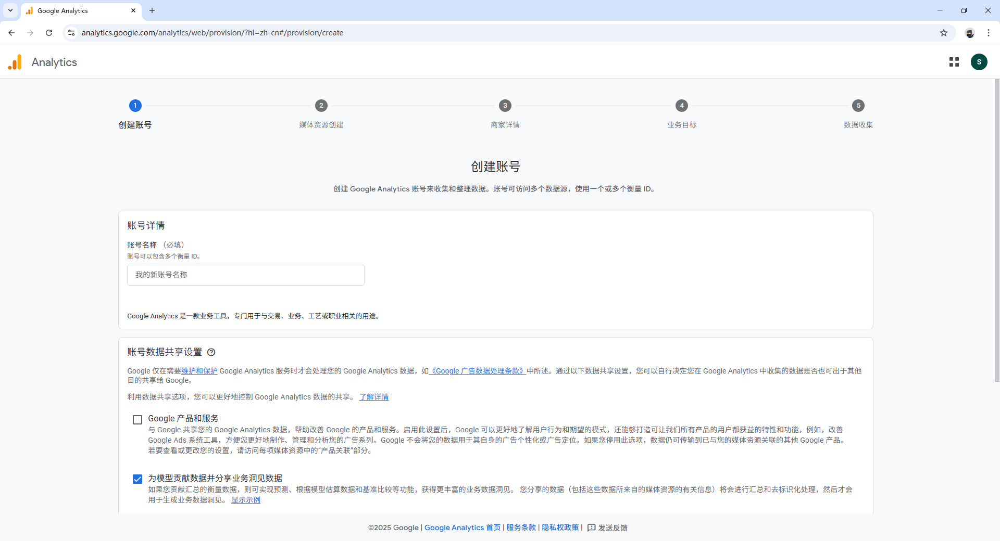
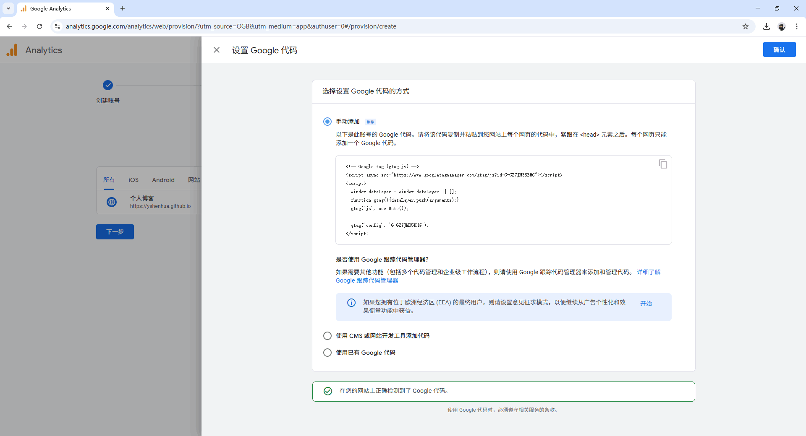
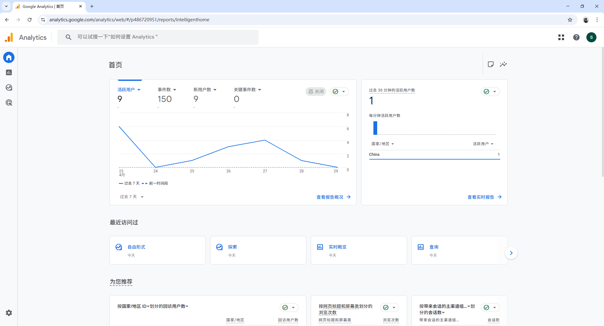

# 如何接入 Google Analytics？

进入 [Google Analytics](https://analytics.google.com/) 平台，创建账号及媒体资源。如果已有媒体资源，可以在管理页面中创建新的账号或媒体资源。

媒体资源创建完成后就可以设置数据流了。数据来源可以是网站、Android 应用或 iOS 应用，以网站为例：选择网站，填写地址和名称，点击创建并继续，然后把生成的 Google 代码添加到网站上，完成之后点击测试安装情况。检测通过后点击确认就设置完成了。

现在开始，用户访问我们网站的一些数据就会被收集到 Google Analytics 上了。

