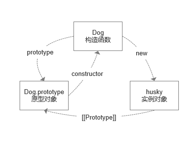

# 继承与原型链

JavaScript 是一门基于对象（Object-Based）的语言，与 Java、C++ 等面向对象（Object-Oriented）的语言不同，它本身没有提供类（class）的实现。那么，它是怎么实现继承的呢？作者 Brendan Eich 为它设计了一种基于原型的继承机制（虽然 JavaScript 在 ES6 开始引入了 `class` 关键字，但那只是语法糖，其本质还是基于原型的）。

## 原型、构造函数与实例

构造函数有一个 prototype 属性，这个属性指向函数的原型对象。原型对象有一个 constructor 属性指向与之关联的构造函数。举个例子：

```js:no-line-numbers
function Dog() {}
Dog.prototype.constructor === Dog;  // true
```

构造函数通过 new 运算符创建实例对象。实例对象有一个 `[[Prototype]]` 指向原型对象。`[[Prototype]]` 可以通过 `Object.getPrototypeOf()` 和 `Object.setPrototypeOf()` 访问器来访问，它等同于一个非标准但许多浏览器都实现了的属性 `__proto__`。

```js:no-line-numbers
const husky = new Dog();
Object.getPrototypeOf(husky) === Dog.prototype; // true
```

原型、构造函数与实例三者之间的关系如下图所示：


### new 运算符做了什么？

1. 创建一个空对象；
2. 为该对象添加 `[[Prototype]]`，该特性指向构造函数的原型对象；
3. 执行构造函数，将该对象作为 `this` 的上下文；
4. 如果构造函数返回一个对象，那么返回值就是这个对象，否则返回 `this`，即前面步骤创建的对象。

## 原型链

实例对象有一个原型对象，该原型对象也有一个自己的原型对象，层层向上直到一个对象的原型对象为 `null`。这条从实例对象到 `null` 的关系链便是原型链。上面例子中 `husky` 的原型链为： `husky ---> Dog.prototype ---> Object.prototype ---> null`。

### instanceof

`instanceof` 运算符用于检测构造函数的 `prototype` 属性是否出现在某个实例对象的原型链上。

> 语法：_object_ instanceof _constructor_。

```js:no-line-numbers
husky instanceof Dog;   // true
husky instanceof Object;    // true
```

它运算时会使用 `Symbol.hasInstance` 函数来确定关系，即 `Dog[Symbol.hasInstance](husky)`。这个属性定义在 `Function.prototype` 上，我们可以在构造函数上重新定义这个函数，比如：

```js:no-line-numbers
Object.defineProperty(Dog, Symbol.hasInstance, {
    value: function(instance) {
        return '';
    }
});
Dog[Symbol.hasInstance](husky); // ''
husky instanceof Dog;   // false
```

### isPrototypeOf()

`isPrototypeOf()` 方法用于测试一个对象是否存在于另一个对象的原型链上。

> 语法：_prototypeObj_.isPrototypeOf(_object_)

```js:no-line-numbers
Dog.prototype.isPrototypeOf(husky)  // true
Object.prototype.isPrototypeOf(husky)   // true
```

### 创建对象的几种方法和它们生成的原型链

```js:no-line-numbers
var o1 = {a: 1};
// 原型链：o1 ---> Object.prototype ---> null

var o2 = new Object({a: 2});
// 原型链：o2 ---> Object.prototype ---> null

var C = function() { this.a = 3; }
var o3 = new C();
// 原型链：o3 ---> M.prototype ---> Object.prototype ---> null

var p = {a: 4};
var o4 = Object.create(p);
// 原型链：o4 ---> p ---> Object.prototype ---> null
```

### 基于原型链的继承

实例对象的属性一部分来自构造函数，另一部分引用自原型对象。当我们试图访问一个对象的属性时，JavaScript 解释器会先在该对象本身的属性中查找，如果没有该属性，就在该对象的原型对象中查找，如果还是没找到，就在该对象的原型对象的原型对象中查找，依次层层向上查找，直到找到一个名字匹配的属性或到达原型链的末尾 `null`。

在较长的原型链上查找属性比较耗时，对性能有副作用，这在性能要求苛刻的情况下很重要。另外，试图访问不存在的属性时会遍历整个原型链。

## class 语法糖

用 `class` 定义类可以直接通过 `extends` 实现继承。我们用构造函数和原型链也可以实现。

```js:no-line-numbers
class Dog {
    constructor(name) {
        this.name = name;
    }
    getName() {
        return this.name;
    }
}

class Husky extends Dog {
    constructor() {
        super('husky');
        this.shape = '中型犬';
    }
}

// 相当于：

function Dog(name) {
    this.name = name;
}
Object.defineProperty(Dog.prototype, 'getName', {
    value: function() {
        return this.name;
    }
});

function Husky() {
    Dog.call(this, 'husky');
    this.shape = '中型犬';
}
Husky.prototype = Object.create(Dog.prototype);
Object.defineProperty(Husky.prototype, 'constructor', {
    value: Husky
});
```
