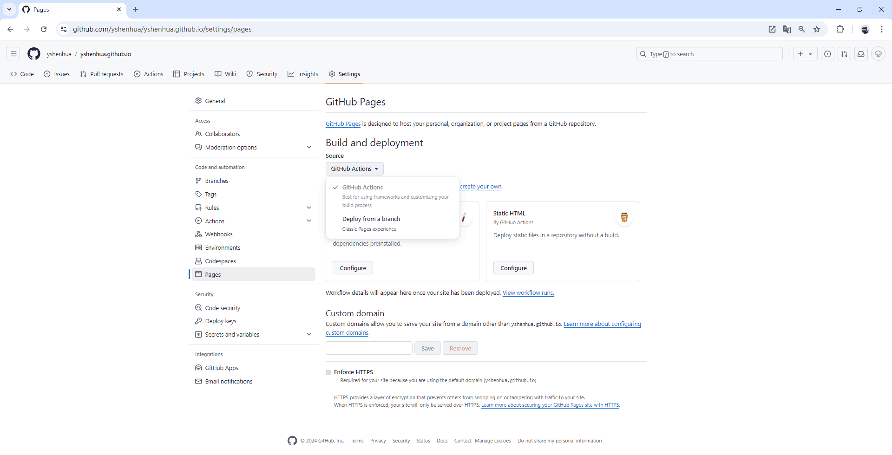

# 使用 VitePress 快速搭建静态站点

## 项目创建

我们可以通过 `npx vitepress init` 命令构建一个基本项目，也可以用 `npm i vitepress -D` 将 vitepress 安装到现有项目中。

安装完成后，通过 `npx vitepress dev` 命令可以启动本地开发服务器。同时项目的根目录中会多出一个 `.vitepress` 目录，这是 VitePress 配置文件、开发服务器缓存、构建输出和可选主题自定义代码的位置。`.vitepress` 目录之外的 Markdown 文件被视为**源文件**。VitePress 使用**基于文件的路由**：每个 `.md` 文件将在相同的路径被编译成为 `.html` 文件。假设此时项目的文件结构如下：

```
.
├─ .vitepress
├─ node_modules
├─ tutorial
│  ├─ index.md
│  ├─ step-1.md
│  └─ step-2.md
├─ index.md
├─ package-lock.json
└─ package.json
```

那么我们可以在站点路径 `/`、`/tutorial/`、`/tutorial/step-1.html`、`/tutorial/step-2.html` 上查看到对应的页面。

## 资源处理

VitePress 使用 [markdown-it](https://github.com/markdown-it/markdown-it) 作为 Markdown 渲染器，并且内置了一些 [Markdown 扩展](https://vitepress.dev/zh/guide/markdown)，也支持在 Markdown 文件的顶部使用 [YAML frontmatter](https://vitepress.dev/zh/guide/frontmatter)（使用 [gray-matter](https://github.com/jonschlinkert/gray-matter) 解析），例如：

```md
---
layout: home
hero:
  name: 文燚的博客
  image:
    src: /images/words.png
pageClass: home-page
---
```

也支持在 Markdown 中使用 Vue 功能，例如：

```md
<script setup>
import Catalog from '@theme/components/Catalog.vue'
</script>

<Catalog />
```

所有的 Markdown 文件都会被编译成 Vue 组件，并由 [Vite](https://cn.vitejs.dev/guide/assets) 处理。常见的图像，媒体和字体文件会被自动检测并视作资源，我们使用相对路径来引用即可。不会被自动视作资源的文件可以放置在项目的 `public` 目录中（事实上任何文件都可以放置到 `public` 中），然后使用根绝对路径来引用——例如：`public/images/words.png` 在源代码中使用 `/images/words.png` 引用。

## 站点配置

在 `.vitepress` 目录创建一个 `config.[ext]` 文件，`[ext]` 可以是 `.js`、`.ts`、`.mjs` 或者 `.mts`。在该文件中导出一个站点配置对象，例如：

```ts
import { defineConfig } from 'vitepress';

export default defineConfig({
  lang: 'zh-Hans',
  title: '文燚的博客',
  description: '一个记录学习笔记和个人作品的IT技术博客网站',
  cleanUrls: true,
  rewrites: {
    ':folder/(.*)/:file': ':folder/:file',
  },

  // 主题相关配置
  themeConfig: {
    nav: [
      { text: '学习笔记', link: '/catalog/', activeMatch: '/(?!portfolio/).+' },
      { text: '个人作品', link: '/portfolio/' },
    ],
    sidebar: [
      {
        text: 'JavaScript',
        items: [
          { text: '数据类型转换', link: '/javascript/types' },
          { text: '对象深拷贝', link: '/javascript/deep-copy' },
        ],
      },
      {
        text: 'CSS',
        items: [{ text: 'BFC 的特性及其常见应用', link: '/css/block-formatting-context' }],
      },
    ],
    outline: { label: '页面导航', level: [2, 3] },
  },
});
```

`lang`、`title`、`description` 用于配置站点元数据。`cleanUrls` 设置为 `true` 时，生成的入站链接不带 `.html` 后缀。`rewrites` 重新定义了源目录结构和生成页面之间的映射。`themeConfig` 中的选项是主题相关配置。完整站点配置选项请参考[官方文档](https://vitepress.dev/zh/reference/site-config)。

使用 `defineConfig` 辅助函数将为配置选项提供 TypeScript 支持的智能提示，但仅适用于默认主题。如果使用[自定义主题](https://vitepress.dev/zh/guide/custom-theme)，辅助函数需改用 `defineConfigWithTheme<ThemeConfig>`，传入自定义主题的配置类型。

## 站点部署

以部署到 [GitHub Pages](https://pages.github.com) 为例，打开仓库设置中的 Pages 菜单，将 Build and deployment 下的 Source 设置为 GitHub Actions。



在项目的 `.github/workflows` 目录中创建一个名为 `deploy.yml` 的文件，其中包含这样的内容：

```yaml
name: Deploy VitePress site to Pages

on:
  # 每当 push 到 main 分支时触发部署
  push:
    branches: [main]
  # 允许手动触发部署
  workflow_dispatch:

# 设置 GITHUB_TOKEN 的权限，以允许部署到 GitHub Pages
permissions:
  contents: read
  pages: write
  id-token: write

# 只允许同时进行一次部署，跳过正在运行和最新队列之间的运行队列
# 但是，不要取消正在进行的运行，因为我们希望允许这些生产部署完成
concurrency:
  group: pages
  cancel-in-progress: false

jobs:
  # 构建工作
  build:
    runs-on: ubuntu-latest
    steps:
      - name: Checkout
        uses: actions/checkout@v4
        with:
          fetch-depth: 0 # 如果未启用 lastUpdated，则不需要
      - name: Setup Node
        uses: actions/setup-node@v4
        with:
          node-version: 20
          cache: npm
      - name: Setup Pages
        uses: actions/configure-pages@v4
      - name: Install dependencies
        run: npm ci
      - name: Build with VitePress
        run: npm run docs:build
      - name: Upload artifact
        uses: actions/upload-pages-artifact@v3
        with:
          path: docs/.vitepress/dist
  # 部署工作
  deploy:
    environment:
      name: github-pages
      url: ${{ steps.deployment.outputs.page_url }}
    needs: build
    runs-on: ubuntu-latest
    name: Deploy
    steps:
      - name: Deploy to GitHub Pages
        id: deployment
        uses: actions/deploy-pages@v4
```

现在将更改推送到 `main` 分支就会触发 GitHub Action 工作流进行站点部署了。
