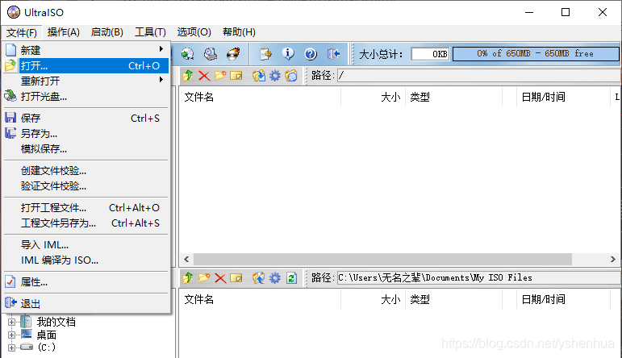
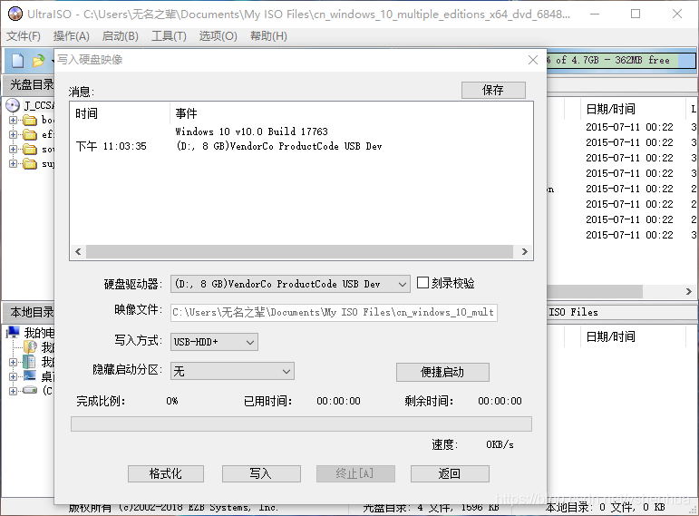
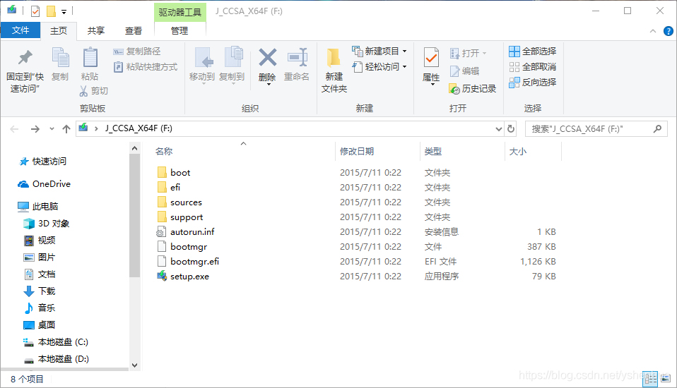
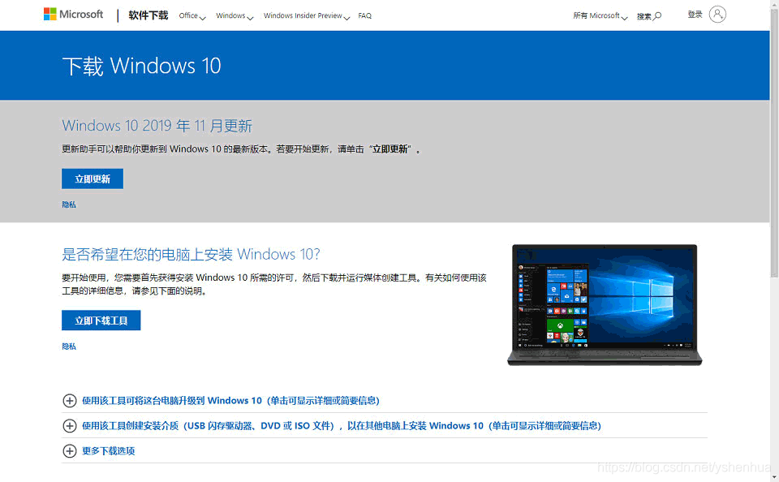
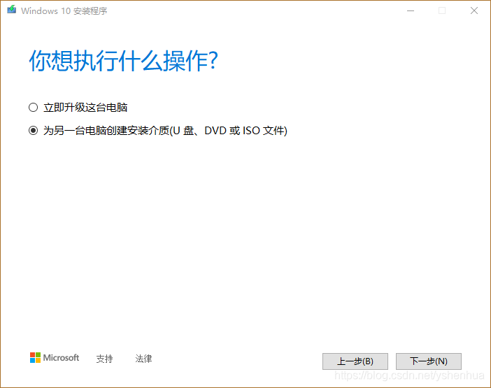
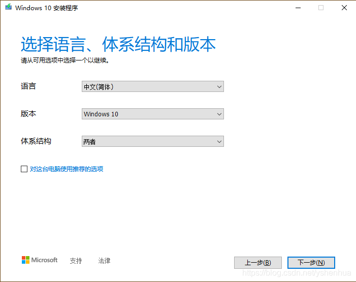
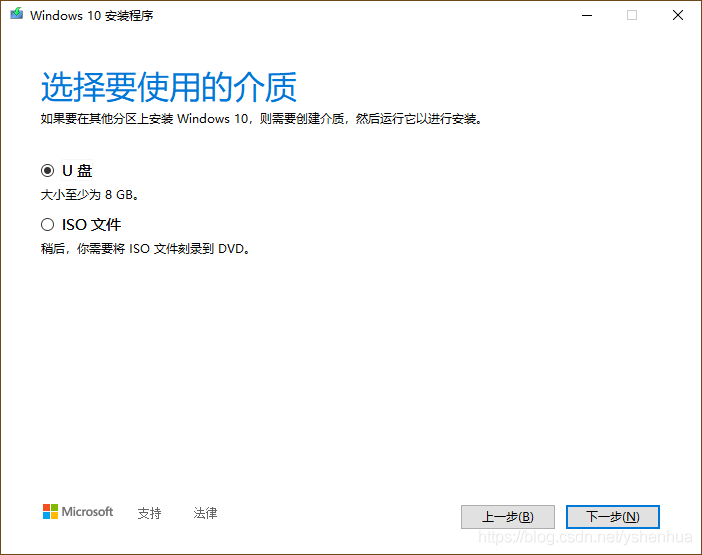
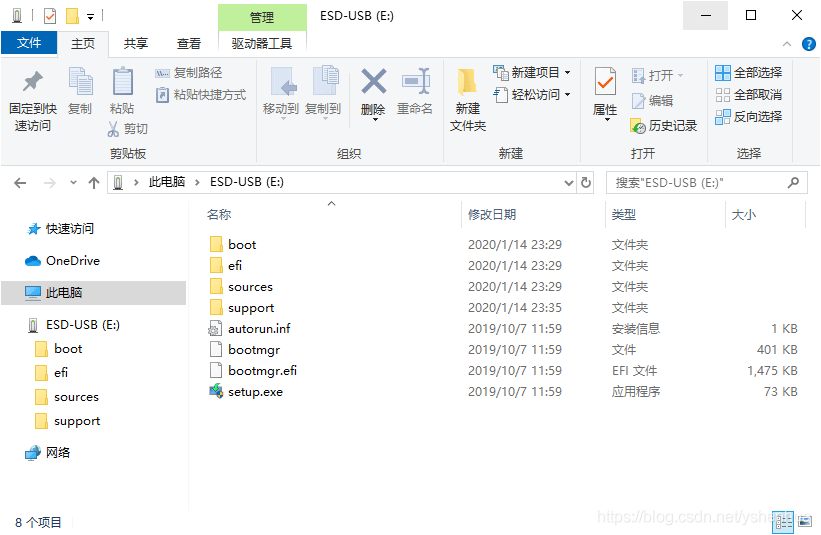

# 如何制作启动盘？

## 使用 UtralSO 制作 U 盘启动盘

**文件 -> 打开…，选择系统镜像**

**启动 -> 写入硬盘映像，点击写入**

**写入成功后，打开 U 盘就可以看到系统的安装程序了**

## 使用微软官方工具制作启动盘

**在微软官网的[软件下载页面](https://www.microsoft.com/zh-cn/software-download/windows10)下载介质创建工具，下载之后双击运行**

**接受许可条款后会出现选项，选择创建安装介质**

**之后就可以选择系统版本了**

**再之后选择要使用的介质，这里我们选择 U 盘**

**所有选择完成之后就会开始下载系统了，下载完成之后会自动写入 U 盘**

